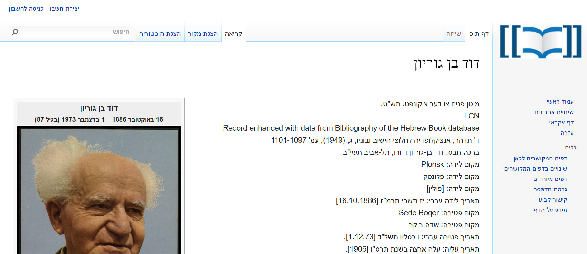
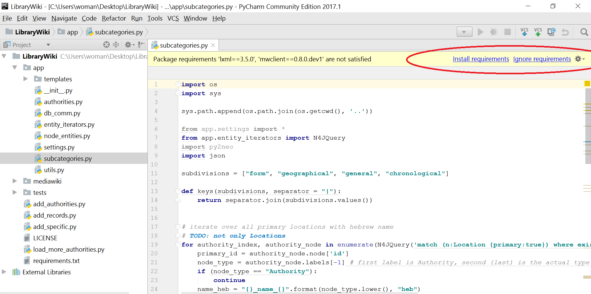
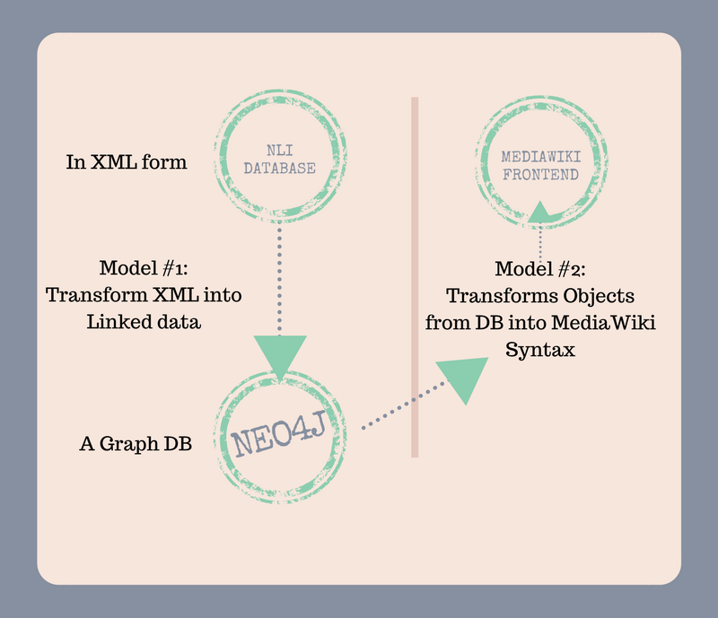
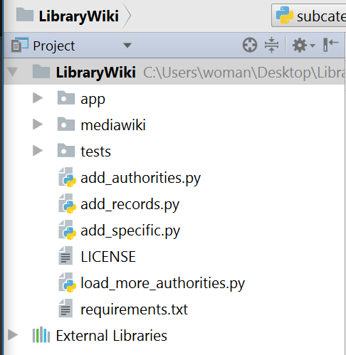

Welcome friends to the Github Repo of the LibraryWiki project.

A live demo is available here: http://84.95.208.20:14180/index.php/000017959

Screenshots:




- [Features](#features)
- [Getting Started](#getting-started)
- [Querying the Database](#querying-the-database)
- [Project Structure](#project-structure) 
- [License](#license)


Features
--------


- **Wikimedia GUI** of the National Library of Israel's extensive Database.


Getting Started
---------------

The first steps is to make set up your local environment.

1) Download python version 3.6.1

https://www.python.org/downloads/

2) Download Pycharm IDE

https://www.jetbrains.com/pycharm/download/#section=windows

3) Clone the repository and install the dependencies via Pycharm:

```bash
# Get the latest snapshot
git clone https://github.com/AdirShemesh/LibraryWiki/

```

Install Dependencies via Pycharm IDE




<hr>

Querying the Database
---------------

To query the database, navigate to:

http://84.95.208.20:7474/browser/


Project Structure
-----------------

The application uses the following two models to pull data from the NLI database and prepare it for the <a href="https://www.mediawiki.org/wiki/MediaWiki">Mediawiki</a> frontend.



By the time the project is deployed, Mediawiki has created its own database which the user interacts with.

The database is divided into Authorities (ex:"David Ben Gurion") and Records (ex:"A Book written by David Ben Gurion"). There is a page for every authority and a page for every record (and links between them). As a Graph Database, there are also edges (i.e. relationships) between the Records and Authorities. For example, "author of" or "subject of", are possible relationships between the DB's nodes.

There are 4 types of Authorities in the NLI library:

- **Personality**
- **Location**
- **Institution**
- **Term**


We read NLI's entities from an XML file, and NLI's items (records) from their API.


| Name                               | Description                                                  |
| ---------------------------------- | ------------------------------------------------------------ |
| **app**/                           | This module crawls trough NLI's data and transforms it into linked data, stored in the DB (neo4j).                                                                                         |
| **app**/__init__.py                | Helps render the page for MediaWiki                          |
| **app**/authorities.py             | Parses the authorities from the xml file                     |
| **app**/db_comm.py                 | batch process that parses the xml file and populates the database                       |
| **app**/__init__.py                | Helps render the page for MediaWiki                          |
| **app**/__init__.py                | Helps render the page for MediaWiki                          |

| **mediawiki**/                     | This module takes care of taking data from the DB (neo4j) and creating wiki pages in the mediawiki.                                                                                      |
| **tests**/                         | Just tests                                                   |
| **tests**/add_authorities.py       | Testing                                                      |





**Note:** lorem ipsum


